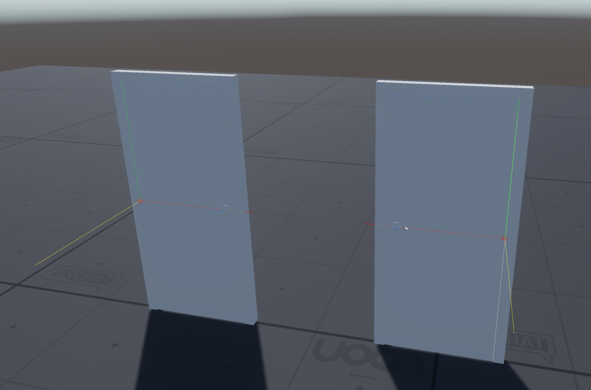

# UdonDoor
Interactive door prefabs for VRChat Udon worlds.

# Usage
1. Place `DoorController.prefab` under the door plate.
2. Configure `Door Controller` UdonBehaviour.

## `Door Controller` UdonBehaviour
1. Set `Door` to reference of the door plate.
2. Set the `Door Local Axis` and the `Door Local Secondary` axis. Refer to the state of the gizmo in the image below.
3. Set the `Max Angle` and the `Min Angle`.

